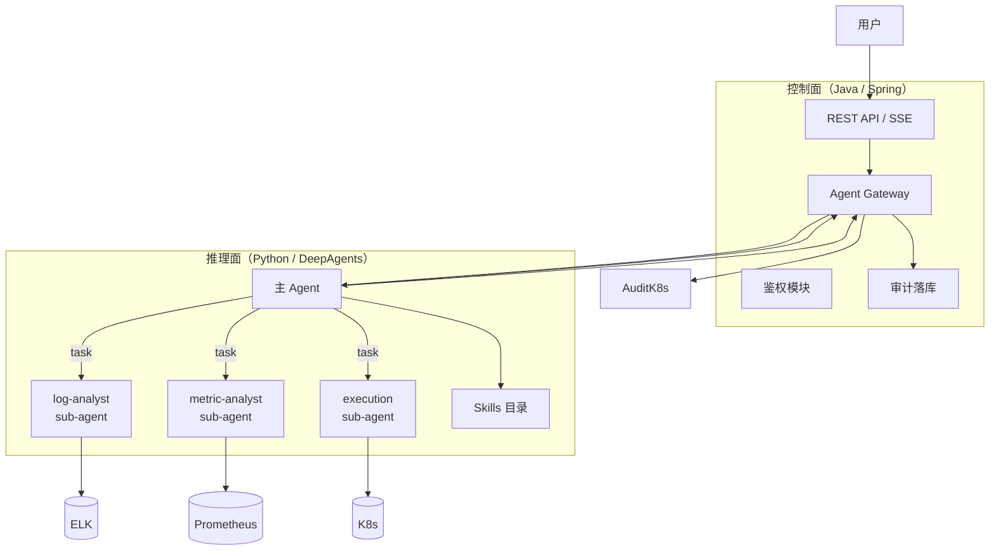
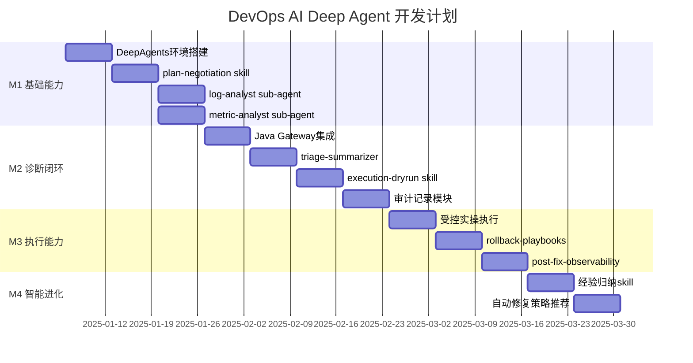

# DevOps AI Deep Agent 开发计划

<aside>
🎯

本文档定义 DevOps AI Deep Agent 的开发计划，基于 **LangChain DeepAgents + Skills** 技术栈，按里程碑拆解任务，明确交付物与验收标准。

</aside>

---

## 一、项目概览

| 项目 | 说明 |
| --- | --- |
| **项目名称** | DevOps AI Deep Agent |
| **目标** | 构建对话式智能运维助手，实现日志分析、指标诊断、故障定位与自动修复 |
| **技术栈** | LangChain DeepAgents + Skills + Spring Boot（控制面） |
| **预计周期** | 12 周（3 个月） |

---

## 二、技术栈（DeepAgents 版）

| 层次 | 技术选型 | 说明 |
| --- | --- | --- |
| **Agent 编排与运行时** | LangChain **DeepAgents** | 基于 LangChain + LangGraph；支持 subagents、todo、文件系统上下文、长期记忆 |
| **研发/调试 CLI** | **deepagents-cli** | 读写文件、shell 执行带人工确认、HTTP、Web 搜索、跨会话记忆、todo |
| **Skills 机制** | Agent Skills | 每个 skill 为目录 + [SKILL.md](http://SKILL.md)，YAML frontmatter 声明 name/description，按需加载；可附脚本/资源https://www.anthropic.com/engineering/equipping-agents-for-the-real-world-with-agent-skills |
| **对外服务层** | Spring Boot / WebFlux | SSE 流式输出、鉴权、审计落库、导出 |
| **可观测/数据源** | Prometheus、ELK | 保持不变 |
| **审计/知识存储** | PostgreSQL/Mongo + 对象存储 | 导出物；Agent 侧记忆可用本地 memories 目录或集中存储 |
| **观测与评估** | LangSmith | 可观测、评测、部署能力 |

---

## 三、两层架构设计



### 职责划分

| 层次 | 职责 |
| --- | --- |
| **控制面（Java）** | 对外 API、鉴权、审计落库、流式推送、安全白名单、二次确认、审批钩子 |
| **推理面（Python）** | 计划生成、sub-agent 编排、skills 调用、结果汇总、上下文隔离 |

---

## 四、Sub-Agents 设计

| Sub-Agent | 工具集 | 职责 |
| --- | --- | --- |
| **log-analyst** | ELK 查询/聚合/采样 | 日志诊断，输出摘要（避免 context bloat） |
| **metric-analyst** | PromQL 查询/异常检测 | 指标诊断，识别资源瓶颈与异常 |
| **triage-summarizer** | 无外部工具 | 合并日志/指标结果，给出置信度与下一步 |
| **execution-agent** | kubectl/shell（受控） | 命令生成、dry-run、受控执行 |

---

## 五、Skills 目录设计

### 全局 Agent 配置

```
~/.deepagents/devops-agent/
├── [agent.md](http://agent.md)              # 全局 personality/style（自动加载）
└── skills/
    ├── plan-negotiation/
    │   └── [SKILL.md](http://SKILL.md)
    ├── elk-log-analysis/
    │   ├── [SKILL.md](http://SKILL.md)
    │   └── scripts/
    │       └── elk_[query.py](http://query.py)
    ├── prom-metric-diagnosis/
    │   ├── [SKILL.md](http://SKILL.md)
    │   └── resources/
    │       └── promql_[templates.md](http://templates.md)
    ├── execution-dryrun/
    │   ├── [SKILL.md](http://SKILL.md)
    │   └── scripts/
    │       └── safe_[kubectl.sh](http://kubectl.sh)
    ├── rollback-playbooks/
    │   ├── [SKILL.md](http://SKILL.md)
    │   └── playbooks/
    │       ├── nginx_[reload.md](http://reload.md)
    │       └── pod_[restart.md](http://restart.md)
    └── post-fix-observability/
        ├── [SKILL.md](http://SKILL.md)
        └── resources/
            └── slo_[gate.md](http://gate.md)
```

### 项目级配置（可提交到 Git）

```
my-project/
├── .git/
└── .deepagents/
    ├── [agent.md](http://agent.md)          # 项目专属指令
    └── skills/           # 项目专属 skills
```

### [SKILL.md](http://SKILL.md) 示例

```yaml
---
name: elk-log-analysis
description: 用于ELK日志诊断：按时间窗采样、聚类模式、提取关键异常，并输出可执行的下一步排查建议
---

# 目标
- 给出：问题摘要 / 典型日志片段(去敏) / 可能根因 / 置信度 / 下一步动作

# 约束
- 不要输出全量日志
- 任何涉及生产变更的建议必须转交给 execution-dryrun skill
```

---

## 六、里程碑总览



---

## 七、M1：DeepAgents 基础能力（第 1-4 周）

### 7.1 目标

- 搭建 DeepAgents 运行环境与 CLI 调试环境
- 完成 plan-negotiation skill 沉淀
- 实现 log-analyst / metric-analyst sub-agent

### 7.2 任务拆解

| 任务 | 预估工时 | 交付物 |
| --- | --- | --- |
| **DeepAgents 环境搭建** | 2d | `pip install deepagents-cli`、`deepagents create devops-agent`、本地验证 |
| **devops-agent 初始化** | 1d | agent 目录结构、skills 目录、memories 配置 |
| **plan-negotiation skill** | 3d | [SKILL.md](http://SKILL.md) + plan.schema.json + [confirm.phrases.md](http://confirm.phrases.md) |
| **log-analyst sub-agent** | 4d | ELK 查询工具、elk-log-analysis skill、摘要输出 |
| **metric-analyst sub-agent** | 4d | PromQL 工具、prom-metric-diagnosis skill、异常检测 |
| **主 Agent 编排** | 3d | subagents 注册、task() 调用、结果聚合 |

### 7.3 验收标准

- [ ]  `deepagents skills list` 能列出所有 skills
- [ ]  用户输入问题后，主 Agent 调用 plan-negotiation skill 生成计划
- [ ]  用户确认后，log-analyst / metric-analyst 能并发执行（通过 task()）
- [ ]  诊断结果只返回摘要，不污染主对话上下文

---

## 八、M2：诊断闭环与 dry-run（第 5-8 周）

### 8.1 目标

- 完成 Java Gateway 与 DeepAgents 集成
- 实现 triage-summarizer 结果汇总
- 构建 execution-dryrun skill

### 8.2 任务拆解

| 任务 | 预估工时 | 交付物 |
| --- | --- | --- |
| **Java Agent Gateway** | 4d | HTTP 调用 DeepAgents、上下文传递、SSE 转发 |
| **triage-summarizer sub-agent** | 3d | 日志/指标合并、冲突解释、置信度评估 |
| **execution-dryrun skill** | 4d | [SKILL.md](http://SKILL.md) + safe_[kubectl.sh](http://kubectl.sh) + [allowlist.md](http://allowlist.md) + risk_[matrix.md](http://matrix.md) |
| **审计模块（Java）** | 3d | Agent 输出结构化 → Java 落库 → 导出 |
| **流式输出集成** | 3d | DeepAgents 进度 → Gateway → SSE → 前端 |

### 8.3 验收标准

- [ ]  诊断过程以流式方式输出，用户可感知进度
- [ ]  dry-run 执行后返回命令预览与模拟输出（CLI 人工确认范式）
- [ ]  所有操作记录通过 Java 审计模块落库、可导出

---

## 九、M3：受控执行与回滚预案（第 9-11 周）

### 9.1 目标

- 实现受控的实际执行能力
- 沉淀 rollback-playbooks skill
- 构建 post-fix-observability skill

### 9.2 任务拆解

| 任务 | 预估工时 | 交付物 |
| --- | --- | --- |
| **受控实操执行** | 4d | execution-agent 实操模式、Java 二次确认钩子 |
| **rollback-playbooks skill** | 3d | [SKILL.md](http://SKILL.md) + playbooks/（nginx_reload、pod_restart 等） |
| **post-fix-observability skill** | 3d | [SKILL.md](http://SKILL.md) + slo_[gate.md](http://gate.md)（观测窗口阈值、判定逻辑） |
| **安全白名单机制** | 3d | Java 控制面白名单校验、审批钩子 |
| **异常处理与回滚** | 2d | 执行失败 → 自动匹配回滚预案 → 建议/执行 |

### 9.3 验收标准

- [ ]  实操执行需 Java 控制面二次确认，带影响提示
- [ ]  执行失败自动匹配 rollback-playbooks 中的预案
- [ ]  观测窗口内验收通过才算修复成功

---

## 十、M4：经验归纳与智能推荐（第 12 周）

### 10.1 目标

- 从历史诊断中归纳经验规则
- 沉淀为可复用 skills
- 实现智能修复策略推荐

### 10.2 任务拆解

| 任务 | 预估工时 | 交付物 |
| --- | --- | --- |
| **经验归纳 skill** | 3d | 模式提取、规则生成、[SKILL.md](http://SKILL.md) 自动更新 |
| **策略推荐** | 2d | 基于历史的修复建议排序、置信度标注 |
| **反馈学习** | 2d | 用户反馈收集 → memories 更新 → skill 优化 |

### 10.3 验收标准

- [ ]  相似问题能推荐历史有效的修复策略
- [ ]  诊断准确率较 M1 提升 20%+
- [ ]  用户反馈能沉淀到 skills/memories 中

---

## 十一、风险与应对

| 风险 | 影响 | 应对措施 |
| --- | --- | --- |
| **语言栈冲突（Java vs Python）** | 集成复杂度高 | 两层架构隔离：Java 做网关与治理，DeepAgents 做编排 |
| **CLI ≠ 生产运行时** | 权限/并发/隔离难控 | CLI 用于研发调试，生产用 deepagents 库封装服务 |
| **Skills 安全风险** | 脚本执行权限大 | 白名单 + 二次确认 + 审批钩子放在 Java 控制面兜底 |
| **Context bloat** | 主对话上下文超限 | sub-agent 隔离，只返回摘要 |
| **LLM 响应延迟** | 用户体验差 | 流式输出、进度提示、超时降级 |

---

## 十二、最小闭环验证（Quick Win）

> **目标**：1~2 天跑通核心链路
>

### 步骤

1. **安装 deepagents-cli**

    ```bash
    # 推荐使用 uv
    uv venv
    uv pip install deepagents-cli
    
    # 或使用 pip
    pip install deepagents-cli
    ```

2. **创建 devops-agent**

    ```bash
    deepagents create devops-agent
    ```

3. **添加 skills**

    ```bash
    # 创建 skills
    deepagents skills create plan-negotiation --agent devops-agent
    deepagents skills create elk-log-analysis --agent devops-agent
    deepagents skills create prom-metric-diagnosis --agent devops-agent
    
    # 查看已有 skills
    deepagents skills list --agent devops-agent
    ```

4. **CLI 本地验证**

    ```bash
    # 启动 agent
    deepagents --agent devops-agent
    
    # 或使用 auto-approve 跳过确认（仅测试环境）
    deepagents --agent devops-agent --auto-approve
    ```

5. **接入 Java Gateway**
   - `/api/v1/diagnose/run` → 调用 DeepAgents HTTP 接口

---

## 十三、检查清单

### M1 交付检查

- [ ]  DeepAgents 环境就绪，CLI 可用
- [ ]  plan-negotiation skill 验收
- [ ]  log-analyst / metric-analyst sub-agent 单独测试通过
- [ ]  主 Agent 并发调度 sub-agents 验收

### M2 交付检查

- [ ]  Java Gateway → DeepAgents 集成通过
- [ ]  流式输出体验验收
- [ ]  dry-run 执行演示通过（CLI 人工确认）
- [ ]  审计记录可查询、可导出

### M3 交付检查

- [ ]  实操执行端到端演示
- [ ]  rollback-playbooks skill 覆盖主要场景
- [ ]  post-fix-observability 观测窗口验收

### M4 交付检查

- [ ]  经验归纳 skill 可用
- [ ]  修复策略推荐准确率达标
- [ ]  反馈学习闭环建立