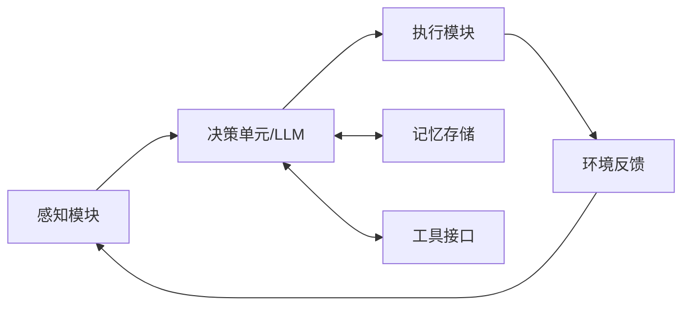
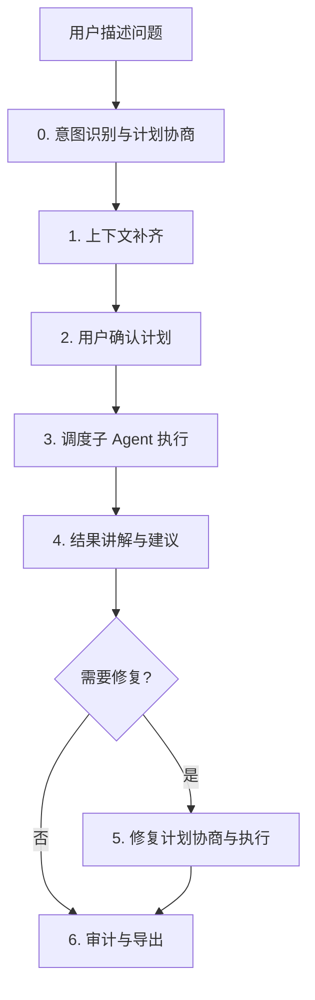

[Devops deep Agent 开发计划](https://www.notion.so/Devops-deep-Agent-2c760be74f498015b362ecd424f2723d?pvs=21)

<aside>
📋

本文档定义 DevOps AI Deep Agent 的功能需求，涵盖**开发辅助**与**智能运维**两大场景。Agent 通过自然语言与用户交互，实现代码生成、质量检查、日志分析、故障诊断与自动修复等能力。

</aside>

---

## 一、执行摘要（TL;DR）

| 维度 | 要点 |
| --- | --- |
| **核心定位** | 由 LLM 驱动的自治智能体，具备自主感知、决策推理、行动执行与自我反思能力 |
| **交互原则** | 先产出「分析/执行计划」，需用户明确确认后再调度子 Agent |
| **开发场景** | 代码生成与补全、智能代码审查、测试用例生成、缺陷预测、架构设计建议 |
| **运维场景** | 故障预测、根因分析、自主恢复、智能告警、资源调度优化 |
| **风控要求** | 一切变更先 dry-run，需用户明确语句确认实操；给出回滚与观察建议 |

---

## 二、智能体架构与核心能力

### 2.1 架构概览



### 2.2 核心组件

| 组件 | 职责 |
| --- | --- |
| **感知模块** | 获取环境信息：代码仓库、监控指标、日志、告警、用户输入 |
| **决策单元** | 基于 LLM 进行意图解析、任务规划、推理决策 |
| **执行模块** | 调用外部工具（CI/CD、kubectl、API）执行具体动作 |
| **记忆存储** | 短期记忆（会话上下文）+ 长期记忆（历史经验、知识库） |
| **工具接口** | 封装外部 API，支持函数调用（Function Calling） |

### 2.3 关键能力清单

- [ ]  **上下文理解**：获取并理解代码库、系统配置、监控数据等上下文
- [ ]  **推理决策**：基于目标自主制定方案，支持大任务拆解为子任务
- [ ]  **工具使用**：调用 CI/CD、监控 API、kubectl 等外部工具
- [ ]  **自我反思**：监控自身行为效果，逐步优化决策策略
- [ ]  **多 Agent 协作**：支持多个专长 Agent 协同工作

---

## 三、开发阶段应用场景

### 3.1 代码生成与补全

| 项目 | 说明 |
| --- | --- |
| **能力描述** | 根据自然语言描述或上下文，自动生成代码片段、函数、配置文件 |
| **典型场景** | 生成样板代码、Terraform/Ansible 配置、Jenkinsfile、GitHub Actions |
| **预期效果** | 减少重复性编码，编码效率提升 20-50% |

### 3.2 智能代码审查

| 项目 | 说明 |
| --- | --- |
| **能力描述** | 代码提交/合并前自动检查质量和安全性，捕获语法错误、潜在漏洞、性能隐患 |
| **典型场景** | MR/PR 自动审查，给出漏洞、规范、性能三类意见 |
| **预期效果** | 准确率 ≥85%，误报 <10%，缺陷早期发现率提升 |

### 3.3 测试用例生成

| 项目 | 说明 |
| --- | --- |
| **能力描述** | 基于需求文档或代码路径，自动生成单元测试、接口测试脚本 |
| **典型场景** | 根据接口契约生成测试用例，模拟边界情况 |
| **预期效果** | 测试覆盖率达 70%+，减少人工设计测试工作量 |

### 3.4 缺陷预测与预警

| 项目 | 说明 |
| --- | --- |
| **能力描述** | 分析代码复杂度、修改频率、历史缺陷数据，预测高风险模块 |
| **典型场景** | 提交时标记高风险代码片段，提前预警 |
| **预期效果** | 降低缺陷流入生产环境的风险 |

### 3.5 架构设计建议

| 项目 | 说明 |
| --- | --- |
| **能力描述** | 分析现有代码和依赖关系，提出架构优化或重构建议 |
| **典型场景** | 微服务拆分、数据库分区、性能优化方案 |
| **预期效果** | 弥补团队经验盲区，优化系统可维护性 |

---

## 四、运维阶段应用场景

### 4.1 故障预测与异常检测

| 项目 | 说明 |
| --- | --- |
| **能力描述** | 基于时间序列模型分析监控数据，提前发现指标异常趋势 |
| **典型场景** | 内存泄漏、响应时间逐渐升高、磁盘空间不足预警 |
| **预期效果** | 提前发现 95%+ 潜在故障，从"救火"转为"预防" |

### 4.2 根因分析与故障定位

| 项目 | 说明 |
| --- | --- |
| **能力描述** | 综合日志、指标、调用拓扑、变更记录，快速定位故障源头 |
| **典型场景** | 告警聚合归并、级联故障追溯、根因标注 |
| **预期效果** | 告警降噪 99%，分类准确率 ≥96%，定位时间从小时级降至分钟级 |

### 4.3 自主恢复与自愈

| 项目 | 说明 |
| --- | --- |
| **能力描述** | 检测到故障后，自动执行服务重启、流量切换、故障节点隔离、自动回滚 |
| **典型场景** | 服务异常时 30 秒内触发回滚，数据库响应慢时自动扩容 |
| **预期效果** | MTTR 缩短 50%+，系统具备弹性韧性 |

### 4.4 智能告警与通知

| 项目 | 说明 |
| --- | --- |
| **能力描述** | 告警聚合关联、优先级排序、过滤误报，自动生成事故工单 |
| **典型场景** | 将告警风暴压缩为核心事件，附带影响范围和建议处理步骤 |
| **预期效果** | 缓解运维疲劳，减少人工来回传递信息的延误 |

### 4.5 资源调度与性能优化

| 项目 | 说明 |
| --- | --- |
| **能力描述** | 分析资源使用模式，实现动态伸缩与调度优化 |
| **典型场景** | 高峰前预测流量提前扩容，低谷时自动缩容节约成本 |
| **预期效果** | 性能和成本平衡优化，降低人为配置不当导致的资源浪费 |

---

## 五、角色与交互设计

### 5.1 角色定义

| 角色 | 职责 |
| --- | --- |
| **用户（开发/运维工程师）** | 通过对话界面提交问题、请求诊断/执行动作、确认或拒绝操作 |
| **DevOps AI 主 Agent** | 解析意图、补齐上下文、生成计划、编排子 Agent、聚合结果 |
| **代码分析 Agent** | 代码生成、审查、测试用例生成、缺陷预测 |
| **日志分析 Agent** | 检索/聚合日志，返回结构化结果 |
| **指标分析 Agent** | 查询监控指标，进行异常检测 |
| **执行 Agent** | 生成、校验并执行变更命令，返回执行输出与状态 |
| **审计/记录 Agent** | 整理关键操作、参数与结果，生成可追溯记录 |

### 5.2 对话流程



---

## 六、计划驱动的核心流程

### 6.1 计划生成示例

用户输入问题后，主 Agent 生成**分析计划草案**：

> **初步分析计划如下，请确认是否按此执行：**
>

>
>

> **1）范围与上下文**
>

> - 服务：checkout
>

> - 环境：production
>

> - 时间窗口：最近 15 分钟
>

>
>

> **2）日志分析**
>

> - 数据源：prod-logging（ELK）
>

> - 操作：过滤 5xx 日志 → 按时间聚合 → 抽样 10 条典型错误日志
>

>
>

> **3）指标分析**
>

> - 数据源：Prometheus prod
>

> - 操作：查询错误率、CPU、内存、QPS → 识别资源瓶颈
>

>
>

> **4）输出形式**
>

> - 问题摘要 + 影响范围
>

> - 关键指标趋势描述
>

> - 典型日志样例
>

> - 可能原因 + 建议动作
>

### 6.2 用户确认与修改

- **直接确认**："确认按计划执行"
- **局部修改**："环境改成 staging"、"时间改成最近一小时"
- **简化/增强**："先只看日志，不看指标"

### 6.3 执行与流式反馈

确认后，主 Agent 并行调度子 Agent，流式输出进度：

- "正在获取 prod-checkout 最近 15 分钟的日志......"
- "已完成日志聚合，12:05 起错误数提升约 300%......"
- "指标结果：CPU 峰值 95%，错误率显著上升......"

---

## 七、修复动作协商与执行

### 7.1 修复计划生成

基于诊断结果，Agent 列出可选修复动作及影响预估：

- 重启 checkout-worker 副本
- 临时扩容到 5 个副本
- 回滚至上一个稳定版本

### 7.2 安全确认机制

> **修复计划：**
>

> 1. 环境：production
>

> 2. 操作：对 deploy/checkout-worker 执行 rollout restart（先 dry-run）
>

> 3. 风控：仅影响 1 个副本，失败不做实操
>

> 4. 后续：dry-run 成功后再询问是否实操
>

>
>

> 请回复"确认执行修复计划"继续。
>

### 7.3 执行流程

1. 用户明确语句确认
2. 执行 Agent 先 dry-run → 返回命令预览与输出
3. 用户二次确认后执行真实变更
4. 执行后给出回滚建议和观测动作

---

## 八、技术栈与模型选择

### 8.1 核心技术栈

| 层次 | 技术选型 |
| --- | --- |
| **LLM 核心** | GPT-4 / CodeLlama / Deepseek（代码生成与理解） |
| **专业模型** | LSTM / Prophet（时序异常检测）、CodeBERT（代码审查） |
| **知识检索** | RAG + 向量数据库（Pinecone / FAISS / Milvus） |
| **Agent 框架** | LangChain / Semantic Kernel / Haystack |
| **工具调用** | OpenAI Function Calling / MCP 协议 |
| **多 Agent 编排** | Autogen / Agent Orchestration 模式 |

### 8.2 自学习与优化

- **反馈回路**：基于用户反馈（RLHF）优化模型或提示模板
- **增量微调**：定期将企业最新数据增量训练到模型中
- **质量监控**：跟踪响应正确率、时延、用户满意度，发现弱点并迭代改进

---

## 九、对话式体验要点

| 要点 | 说明 |
| --- | --- |
| **状态记忆** | 单次会话内记住已确认的服务、时间范围和诊断 ID，避免重复提问 |
| **术语翻译** | 将复杂指标/日志字段翻译为自然语言，需要时附原始名称 |
| **容错提示** | 缺少数据或规则无法匹配时，引导用户补齐信息，而非直接失败 |
| **安全确认** | 执行命令前需用户明确语句确认，同时提示可能影响 |
| **可观测性** | 运维人员可审计 Agent 行动轨迹，了解决策依据 |

---

## 十、值班检查清单

- [ ]  指定服务与环境（如：checkout, production）
- [ ]  明确时间窗口（如：最近 15 分钟）
- [ ]  选择数据源（prod-logging, Prometheus prod）
- [ ]  确认分析范围（仅日志 / 同时看指标）
- [ ]  是否允许 dry-run 后继续实操
- [ ]  确认审批策略和回滚策略

---

## 附录：示例对话

```
用户：checkout 服务 500 错误暴涨，帮我看看最近 15 分钟的情况。

Agent：收到，我先给出一个分析计划，请你确认是否按此执行：

1）范围与上下文
   - 服务：checkout
   - 环境：production（如有误请更正）
   - 时间：最近 15 分钟

2）日志分析
   - 从 prod-logging 中筛选 checkout 的 5xx 日志
   - 按分钟聚合错误数，找出峰值时间段
   - 抽样 10 条典型错误日志（含 stack trace）

3）指标分析
   - 从 Prometheus 查询 checkout 的错误率、CPU、内存、QPS
   - 判断是否存在资源瓶颈或下游依赖异常

4）输出
   - 问题摘要 + 影响范围
   - 关键指标趋势文字描述
   - 典型日志样例
   - 初步可能原因 + 建议修复动作

请回复"确认按计划执行"，或说明需要调整的部分。

用户：确认按计划执行。

Agent：好的，开始执行分析计划，将以流式方式汇报进度。

[流式输出]
- 正在获取 prod-checkout 最近 15 分钟的 5xx 日志......
- 已完成日志聚合，12:05 起错误数较基线提升约 300%......
- 正在查询 Prometheus 指标......
- 指标结果：12:05~12:10 间 CPU 峰值 95%，错误率显著上升，QPS 持平......

综合分析：
- 问题摘要：从 12:05 起，checkout 服务 5xx 错误显著升高，伴随 CPU 接近打满
- 可能原因：新版本引入的计算密集逻辑或循环重试；暂未发现下游依赖错误峰值同步上升
- 建议修复动作：
  1）重启部分 checkout-worker 副本，缓解个别实例异常状态
  2）短期扩容副本数，缓冲峰值流量

是否需要我基于上述建议生成"重启 1 个副本（先 dry-run）"的修复计划？

用户：先重启一个副本，dry-run 看看。

Agent：好的，将执行 `kubectl rollout restart deploy/checkout-worker`（dry-run）。请回复"确认"继续。

用户：确认。

Agent：dry-run 成功，命令输出如下......需要实操执行吗？
```

Agent：好的，将执行 `kubectl rollout restart deploy/checkout-worker`（dry-run）。

请回复"确认"继续。